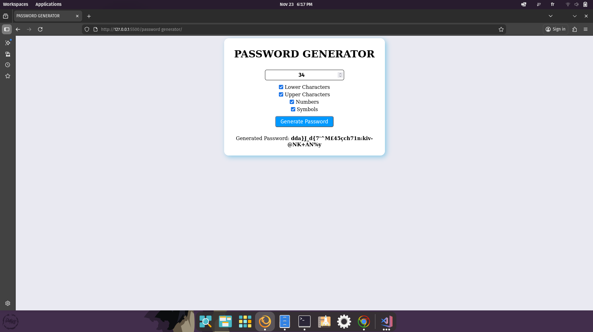

# Password Generator

Welcome to **Password Generator** — a handy tool to generate random passwords with configurable options.

## 🚀 Project Overview
The project lets users choose a password length and which character types should be included (lowercase, uppercase, numbers, symbols), and generates a random password accordingly.

## 🌟 Features
- Choose length and character types
- Generates a random secure-ish password based on choices
- Simple UI to show and copy the generated password (copy to clipboard recommended)

## 🛠️ Technologies Used
- Frontend: HTML, CSS, JavaScript

## 📦 Project Structure
```
index.html      # Main UI
main.js         # Generation logic
style.css       # Styles
```

## 📸 Screenshots


## ✨ How to Use
1. Open `index.html` in your browser.
2. Choose password length and toggle options for lowercase, uppercase, numbers, and symbols.
3. Click 'Generate Password' and optionally copy it to your clipboard.

## Notes & Suggestions
- Consider ensuring that at least one character of each selected type is included in the password.
- Add a 'Copy' button to copy the password to the clipboard.

## 👤 Author
**ISSAM SENSI**

---
© 2025 [issamsensi](https://github.com/issamsensi)
